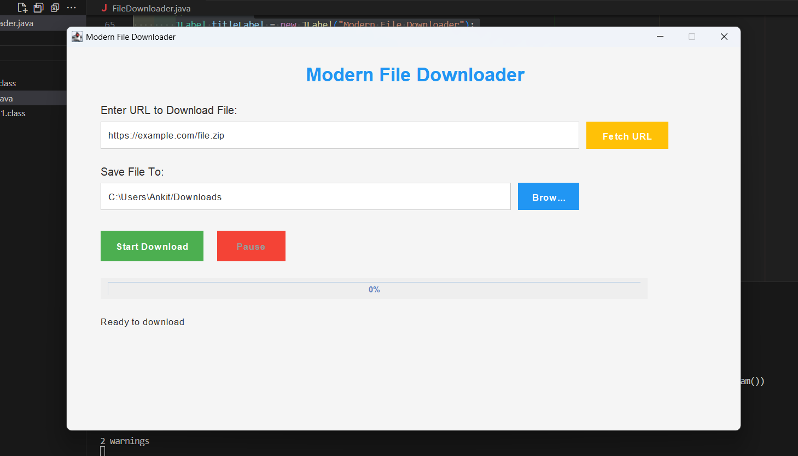
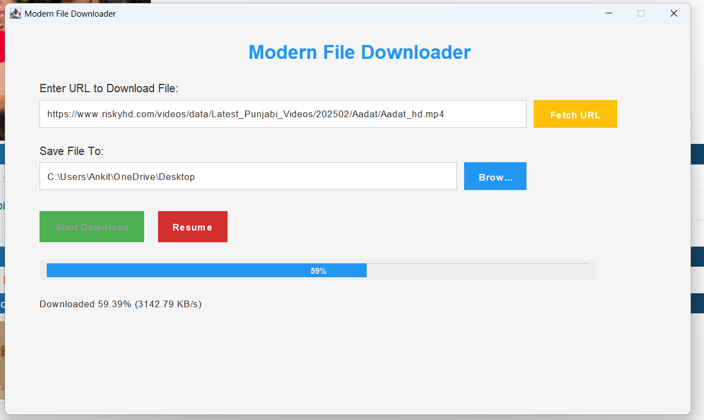

# Modern File Downloader

A sleek, modern, and dynamic file downloader application built in Java. This application allows users to download files from the internet with a user-friendly interface, real-time progress tracking, and advanced features like pause/resume functionality and URL fetching from the clipboard.

---

## Features

- **Modern UI**: Clean and intuitive interface with Poppins font and gradient buttons.
- **Real-Time Progress**: Displays download progress, speed, and time remaining.
- **Pause/Resume**: Pause and resume downloads at any time.
- **Fetch URL from Clipboard**: Automatically fetch URLs from the clipboard.
- **File Overwrite Protection**: Prompts the user before overwriting existing files.
- **Dynamic Download Queue**: Supports queuing multiple downloads.
- **Error Handling**: Provides clear error messages for invalid URLs or network issues.

---

## Screenshots

  
*Main Interface with URL and Save Location Inputs*

  
*Real-Time Progress and Download Speed*

---

## Prerequisites

- **Java Development Kit (JDK)**: Ensure you have JDK 8 or higher installed.
- **Poppins Font**: The application uses the Poppins font from Google Fonts. It will be loaded dynamically.

---

## Installation

1. **Clone the Repository**:
   ```bash
   git clone https://github.com/ankitagr09/javadownloader.git
   cd javadownloader
   ```

2. **Compile the Code**:
   ```bash
   javac FileDownloader.java
   ```

3. **Run the Application**:
   ```bash
   java FileDownloader
   ```

---

## Usage

1. **Enter URL**:
   - Paste the URL of the file you want to download in the "Enter URL to Download File" field.
   - Alternatively, click the **Fetch URL** button to automatically fetch a URL from the clipboard.

2. **Choose Save Location**:
   - Enter the directory where you want to save the downloaded file.
   - Click the **Browse** button to select a directory using the file explorer.

3. **Start Download**:
   - Click the **Start Download** button to begin the download.
   - Monitor the progress bar and download speed in real-time.

4. **Pause/Resume**:
   - Use the **Pause** button to pause the download.
   - Click **Resume** to continue the download.

5. **Download Queue**:
   - Add multiple URLs to the queue for sequential downloading.

---

## Code Structure

- **`FileDownloader.java`**: The main application file containing the GUI and download logic.
- **`README.md`**: This file, providing an overview of the project.
- **`screenshots/`**: Directory containing screenshots of the application.

---

## Customization

- **Font**: The application uses the Poppins font from Google Fonts. You can replace it with any other font by modifying the `addUIComponents` method.
- **Colors**: Customize the button and progress bar colors in the `createModernButton` method.
- **Features**: Add more dynamic features like browser integration or download history.

---

## Contributing

Contributions are welcome! If you'd like to contribute, please follow these steps:

1. Fork the repository.
2. Create a new branch for your feature or bugfix.
3. Commit your changes and push to the branch.
4. Submit a pull request.

---

## License

This project is licensed under the MIT License. See the [LICENSE](LICENSE) file for details.

---

## Acknowledgments

- **Google Fonts**: For providing the Poppins font.
- **Java Swing**: For the GUI framework.
- **Open Source Community**: For inspiration and support.

---

## Contact

For questions or feedback, feel free to reach out:

- **Email**: Garga1217@gmail.com
- **GitHub**: [ankitagr09](https://github.com/ankitagr09/)

---

Enjoy downloading files with ease and style! 🚀

